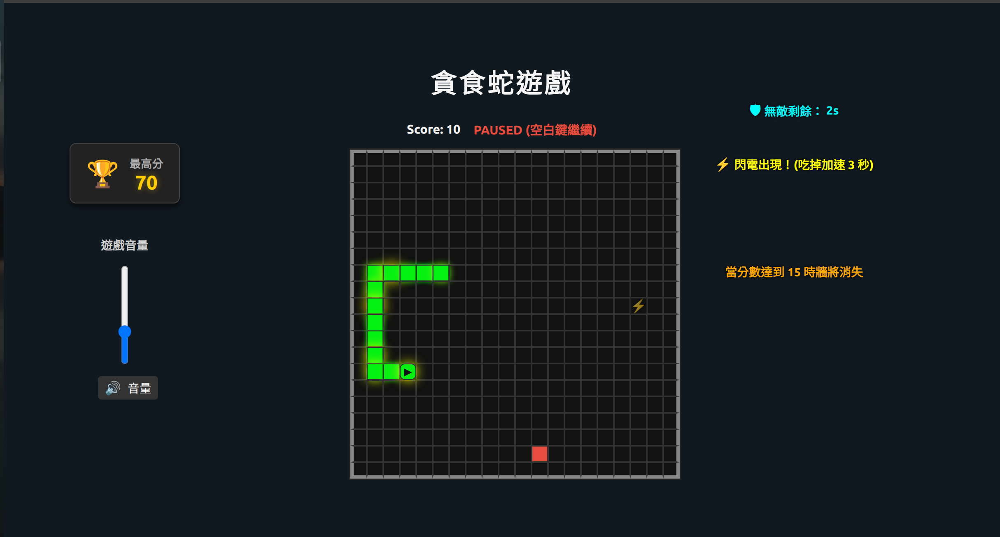

# Snake Game (貪食蛇遊戲)

 <!-- 可自行放遊戲截圖 -->

## 專案介紹
這是一個使用 **React + TypeScript + Vite + CSS** 製作的貪食蛇遊戲。  
目標是打造一個可玩的作品，支援鍵盤操作、道具、牆提示等功能。

---

## 遊戲特色
- **經典貪食蛇玩法**：上下左右方向鍵控制蛇身
- **加速道具**：黃色道具會閃爍，吃到後增加遊戲速度
- **牆生成提示**：當分數達到一定值時，右側會顯示牆即將生成的提示
- **動態分數**：遊戲分數即時更新
- **遊戲暫停/開始**：空白鍵可暫停或開始遊戲
- **音量控制**：左側提供背景音量調整滑桿

---

## 安裝與執行

### 安裝依賴
```bash
# 安裝專案依賴
npm install

# 啟動開發伺服器 (localhost:5173)
npm run dev

# 建置 production
npm run build

# 可以使用 serve 或其他靜態伺服器預覽
npm install -g serve
serve -s dist

#使用說明

方向控制：ArrowUp / ArrowDown / ArrowLeft / ArrowRight
暫停/開始：空白鍵
開始遊戲：在 idle 或 game over 狀態按空白鍵或 Start/Restart 按鈕
音量調整：左側滑桿控制 BGM 音量
牆生成提示：右側顯示，當分數達到指定值時會出現提示

#技術棧

框架：React 18 + TypeScript
打包工具：Vite
樣式：CSS Grid + Flexbox
狀態管理：React Hook
動畫效果：CSS Animation (食物 pop 動畫、加速道具閃爍)

#專案結構
├─ src/
│  ├─ GameBoard.tsx        # 遊戲主畫面
│  ├─ GameBoard.css        # 遊戲樣式
│  ├─ useSnakeGame.ts      # 遊戲邏輯 Hook
│  └─ main.tsx             # React 入口
├─ package.json
├─ vite.config.ts
└─ README.md

#未來功能拓展

增加更多種類的道具（減速、增長等）
加入排行榜與分數存檔功能
遊戲關卡模式，牆壁逐步生成
手機觸控支援