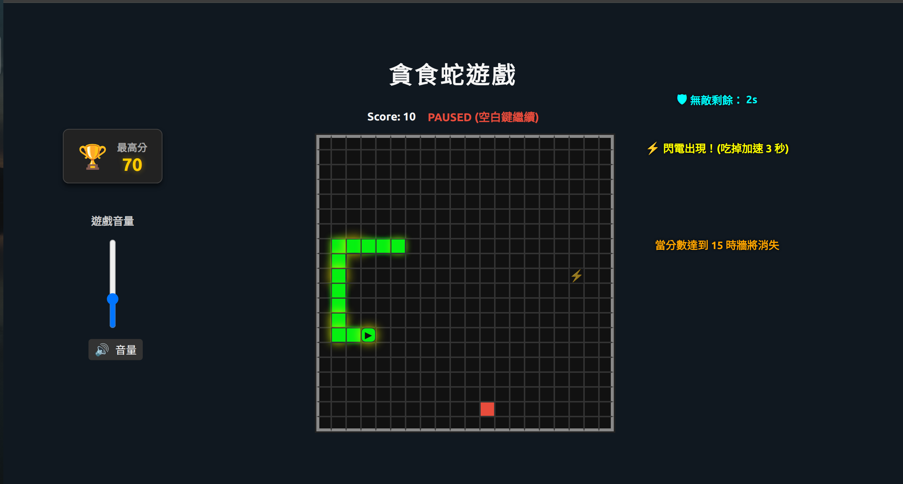

# Snake Game (貪食蛇遊戲)

 <!-- 遊戲截圖 -->
<video src="./public/images/snake_demo.mp4" controls="controls" width="600"></video> <!-- 遊戲錄影 -->
## 專案介紹
這是一個使用 **React + TypeScript + Vite + CSS** 製作的進階版貪食蛇遊戲。  
除了經典的玩法外，還加入了多種動態道具、牆壁障礙機制，並採用了**高度模組化的 React Custom Hooks 架構**來管理遊戲狀態，展現了良好的「關注點分離 (Separation of Concerns)」設計模式。

---

## 🌟 遊戲特色
- **經典貪食蛇玩法**：使用上下左右方向鍵控制蛇身移動。
- **⚡ 加速道具 (閃電)**：黃色閃爍道具，吃到後獲得 3 秒的速度翻倍與專屬霓虹視覺特效。
- **⭐ 無敵星星**：吃到後限時內呈現無敵發光狀態，可以直接穿牆且咬到自己不會死！
- **🧱 動態牆壁機制**：牆壁會隨著分數達到特定階段自動升起與降下，右側面板會即時顯示預告。
- **🏆 歷史最高分**：遊戲會透過瀏覽器的 `localStorage` 自動記錄並顯示你的歷史最高分。
- **🎵 音效與音量控制**：包含吃食物、死亡音效與 BGM，並提供左側音量滑桿與一鍵靜音功能。
- **暫停與恢復**：隨時按下空白鍵即可暫停遊戲，道具的倒數計時也會精準暫停。

---

## 安裝與執行

### 安裝依賴
```bash
# 安裝專案依賴
npm install

# 啟動開發伺服器 (localhost:5173)
npm run dev

# 建置 production
npm run build

# 可以使用 serve 或其他靜態伺服器預覽
npm install -g serve
serve -s dist

#使用說明

方向控制：ArrowUp / ArrowDown / ArrowLeft / ArrowRight
暫停/開始：空白鍵
開始遊戲：在 idle 或 game over 狀態按空白鍵或 Start/Restart 按鈕
音量調整：左側滑桿控制 BGM 音量
牆生成提示：右側顯示，當分數達到指定值時會出現提示

#技術棧

框架：React 18 + TypeScript
打包工具：Vite
樣式：CSS Grid + Flexbox
動畫效果：CSS Animation (食物 pop 動畫、加速道具閃爍)
狀態管理：React Hook
本地儲存：localStorage (最高分紀錄)

#專案結構
├─ src/
│  ├─ components/
│  │  ├─ GameBoard.tsx        # 遊戲主畫面 UI 元件
│  │  └─ GameBoard.css        # 遊戲特效與版面樣式
│  │
│  ├─ hooks/ (狀態與邏輯層)
│  │  ├─ useGameEngine.ts     # 主控台：負責協調所有 Hooks 與主迴圈 (Game Loop)
│  │  ├─ useSnake.ts          # 物理系統：管理蛇的座標、移動與碰撞判定
│  │  ├─ useFood.ts           # 場地系統：管理食物生成位置與牆壁開關邏輯
│  │  ├─ useDirection.ts      # 操控系統：管理鍵盤輸入與防呆佇列 (Queue)
│  │  ├─ useBoost.ts          # 加速系統：管理速度狀態與倒數計時器
│  │  ├─ usePowerups.ts       # 道具系統：管理星星等特殊道具的生成與持續時間
│  │  ├─ useGameScore.ts      # 分數系統：管理當前分數與 localStorage 最高分
│  │  └─ useGameAudio.ts      # 音效系統：管理 BGM 與音效的播放與靜音
│  │
│  └─ main.tsx                # React 進入點
├─ package.json
├─ vite.config.ts
└─ README.md


#未來功能拓展

增加更多種類的道具（減速、增長等）
加入排行榜與分數存檔功能
遊戲關卡模式，牆壁逐步生成
手機觸控支援